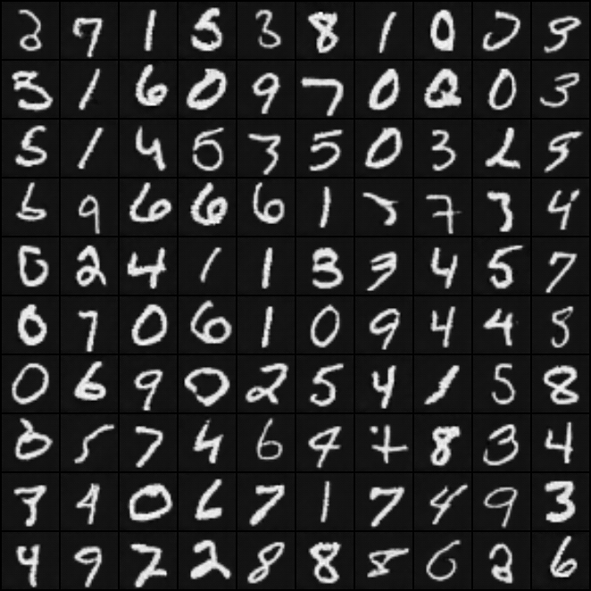
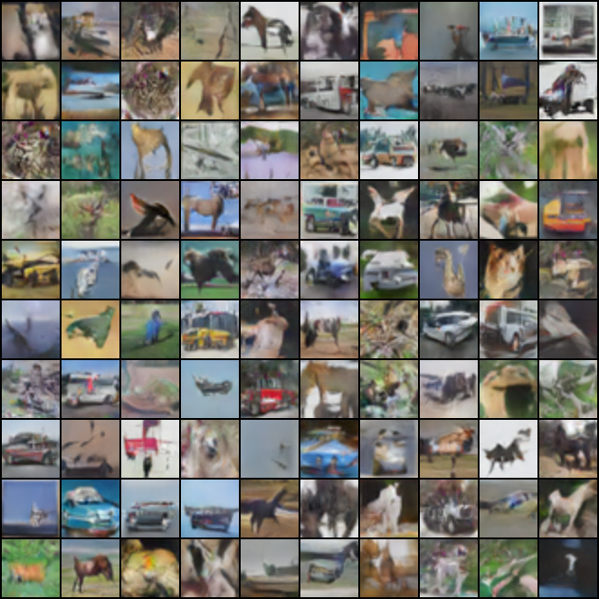
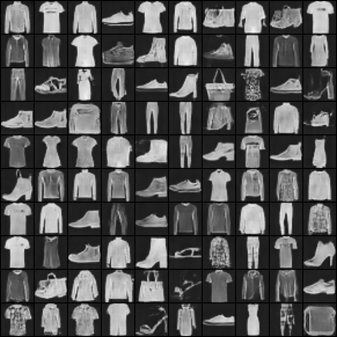

# DCGAN-PyTorch

## Overview
This repository contains an Pytorch implementation of Deep Convolution GAN and Linear GAN structure.
With full coments and my code style.

## About DCGAN
If you're new to DCGAN, here's an abstract straight from the paper[1]:

In recent years, supervised learning with convolutional networks (CNNs) has seen huge adoption in computer vision applications. Comparatively, unsupervised learning with CNNs has received less attention. In this work we hope to help bridge the gap between the success of CNNs for supervised learning and unsuper- vised learning. We introduce a class ofCNNs called deep convolutional generative adversarial networks (DCGANs), that have certain architectural constraints, and demonstrate that they are a strong candidate for unsupervised learning. Training on various image datasets, we show convincing evidence that our deep convolu- tional adversarial pair learns a hierarchy of representations from object parts to scenes in both the generator and discriminator. Additionally, we use the learned features for novel tasks - demonstrating their applicability as general image representations.

## Dataset 
- MNIST
`python3 main.py --dataset mnist --channels 1`
- FashionMNIST
`python3 main.py --dataset fashion --channels 1`
- Cifar10
`python3 main.py --dataset cifar10 --channels 3`

## Implement
``` python
usage: main.py [-h] [--model {gan,dcgan}] [--img_size IMG_SIZE]
               [--channels CHANNELS] [--g_num G_NUM] [--z_dim Z_DIM]
               [--g_conv_dim G_CONV_DIM] [--d_conv_dim D_CONV_DIM]
               [--version VERSION] [--epochs EPOCHS] [--batch_size BATCH_SIZE]
               [--num_workers NUM_WORKERS] [--g_lr G_LR] [--d_lr D_LR]
               [--beta1 BETA1] [--beta2 BETA2]
               [--pretrained_model PRETRAINED_MODEL] [--train TRAIN]
               [--parallel PARALLEL] [--dataset {mnist,cifar10,fashion}]
               [--use_tensorboard USE_TENSORBOARD] [--dataroot DATAROOT]
               [--log_path LOG_PATH] [--model_save_path MODEL_SAVE_PATH]
               [--sample_path SAMPLE_PATH] [--log_step LOG_STEP]
               [--sample_step SAMPLE_STEP] [--model_save_step MODEL_SAVE_STEP]

optional arguments:
  -h, --help            show this help message and exit
  --model {gan,dcgan}
  --img_size IMG_SIZE
  --channels CHANNELS   number of image channels
  --g_num G_NUM         train the generator every 5 steps
  --z_dim Z_DIM         noise dim
  --g_conv_dim G_CONV_DIM
  --d_conv_dim D_CONV_DIM
  --version VERSION     the version of the path, for implement
  --epochs EPOCHS       numer of epochs of training
  --batch_size BATCH_SIZE
                        batch size for the dataloader
  --num_workers NUM_WORKERS
  --g_lr G_LR           use TTUR lr rate for Adam
  --d_lr D_LR           use TTUR lr rate for Adam
  --beta1 BETA1
  --beta2 BETA2
  --pretrained_model PRETRAINED_MODEL
  --train TRAIN
  --parallel PARALLEL
  --dataset {mnist,cifar10,fashion}
  --use_tensorboard USE_TENSORBOARD
                        use tensorboard to record the loss
  --dataroot DATAROOT   dataset path
  --log_path LOG_PATH   the output log path
  --model_save_path MODEL_SAVE_PATH
                        model save path
  --sample_path SAMPLE_PATH
                        the generated sample saved path
  --log_step LOG_STEP   every default{10} epoch save to the log
  --sample_step SAMPLE_STEP
                        every default{100} epoch save the generated images and
                        real images
  --model_save_step MODEL_SAVE_STEP
```

## Usage
- MNSIT
`python3 main.py --dataset mnist --channels 1 --version [version] --batch_size [] >logs/[log_path]`
- FashionMNIST
`python3 main.py --dataset fashion --channels 1 --version [version] --batch_size [] >logs/[log_path]`
- Cifar10
`python3 main.py --dataset cifar10 --channels 3 -version [version] --batch_size [] >logs/[log_path]`

## Tensorboard 
The G loss and D loss record by the tensorboard in the folder, /logs.
``` python
tensorboard --logdir logs/
```

## FID
FID is a measure of similarity between two datasets of images. It was shown to correlate well with human judgement of visual quality and is most often used to evaluate the quality of samples of Generative Adversarial Networks. FID is calculated by computing the Fréchet distance between two Gaussians fitted to feature representations of the Inception network.

For the FID, I use the pytorch implement of this repository. [FID score for PyTorch](https://github.com/mseitzer/pytorch-fid)

For the 10k epochs training on different dataset, compare with about 10000 samples, I get the FID: 

| dataset | DCGAN |
| ---- | ---- |
| MNIST | 42.45529067975039(9500epoch) |
| FASHION-MNIST | 86.17794805798678(7800epoch) | 
| CIFAR10 | 80.03665139141242(9200epoch) |

> :warning: I dont konw if the FID is right or not, because I cant get the lowwer score like the paper or the other people get it. 
## Network structure
``` python
Generator(
  (l1): Sequential(
    (0): ConvTranspose2d(100, 512, kernel_size=(4, 4), stride=(1, 1), bias=False)
    (1): BatchNorm2d(512, eps=1e-05, momentum=0.1, affine=True, track_running_stats=True)
    (2): ReLU(inplace=True)
  )
  (l2): Sequential(
    (0): ConvTranspose2d(512, 256, kernel_size=(4, 4), stride=(2, 2), padding=(1, 1), bias=False)
    (1): BatchNorm2d(256, eps=1e-05, momentum=0.1, affine=True, track_running_stats=True)
    (2): ReLU(inplace=True)
  )
  (l3): Sequential(
    (0): ConvTranspose2d(256, 128, kernel_size=(4, 4), stride=(2, 2), padding=(1, 1), bias=False)
    (1): BatchNorm2d(128, eps=1e-05, momentum=0.1, affine=True, track_running_stats=True)
    (2): ReLU(inplace=True)
  )
  (l4): Sequential(
    (0): ConvTranspose2d(128, 64, kernel_size=(4, 4), stride=(2, 2), padding=(1, 1), bias=False)
    (1): BatchNorm2d(64, eps=1e-05, momentum=0.1, affine=True, track_running_stats=True)
    (2): ReLU(inplace=True)
  )
  (last): Sequential(
    (0): ConvTranspose2d(64, 3, kernel_size=(4, 4), stride=(2, 2), padding=(1, 1), bias=False)
    (1): Tanh()
  )
)
Discriminator(
  (l1): Sequential(
    (0): Conv2d(3, 64, kernel_size=(4, 4), stride=(2, 2), padding=(1, 1), bias=False)
    (1): LeakyReLU(negative_slope=0.2, inplace=True)
  )
  (l2): Sequential(
    (0): Conv2d(64, 128, kernel_size=(4, 4), stride=(2, 2), padding=(1, 1), bias=False)
    (1): BatchNorm2d(128, eps=1e-05, momentum=0.1, affine=True, track_running_stats=True)
    (2): LeakyReLU(negative_slope=0.2, inplace=True)
  )
  (l3): Sequential(
    (0): Conv2d(128, 256, kernel_size=(4, 4), stride=(2, 2), padding=(1, 1))
    (1): BatchNorm2d(256, eps=1e-05, momentum=0.1, affine=True, track_running_stats=True)
    (2): LeakyReLU(negative_slope=0.2, inplace=True)
  )
  (l4): Sequential(
    (0): Conv2d(256, 512, kernel_size=(4, 4), stride=(2, 2), padding=(1, 1))
    (1): BatchNorm2d(512, eps=1e-05, momentum=0.1, affine=True, track_running_stats=True)
    (2): LeakyReLU(negative_slope=0.2, inplace=True)
  )
  (last_adv): Sequential(
    (0): Conv2d(512, 1, kernel_size=(4, 4), stride=(1, 1), bias=False)
  )
)
```
## Result
- MNIST  

- CIFAR10  

- Fashion-MNIST

## Reference
1. [DCGAN](https://arxiv.org/abs/1511.06434)
2. [GAN](https://arxiv.org/abs/1406.2661)
